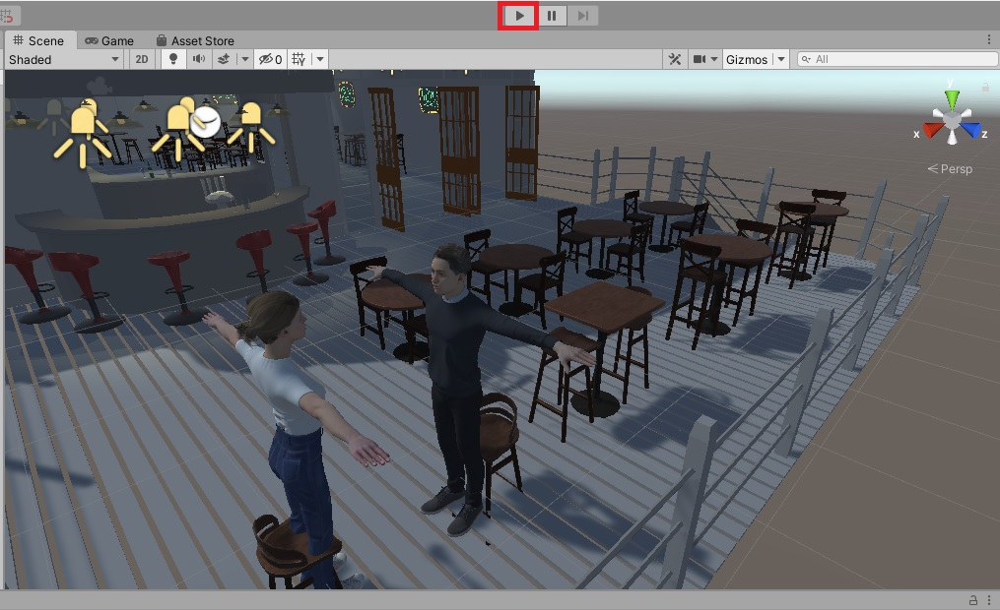

# Restaurant Simulator

Unity version of the simulator that controls customers' non-verbal behaviors and scenario of the serving food in the restaruant

## Preview


## Getting Started

After downloading this file, the fastest way to start this simulator is to start

```
Assets/BarProps/Scenes/Demo.unity
```

To run this simulator, you should download Unity. This simulator is developed in Unity 2019.3.2f1 version.

At this point, there is no function to play the series of animations. The instructions below shows how to apply a single animation to the character.

## Insturction: How to apply animation to character


1. After opening Demo.unity file, click the character that you want to apply an animation


2. Double click the Controller component


3. In Animator, double click the orange box


4. Click the rightmost icon at Inspector/Motion


5. Select the animation that you want to apply



6. Play the Unity Engine


7. See how animations is applied to the character you selected

## Built With

* [Unity](https://unity.com/) - 3D Game Engine that controls Characters/Scenarios
* [Blender](https://www.blender.org/) - Used for creating the custom animations for 3D characters
* [Unity Asset Store](https://assetstore.unity.com/) - Downloaded/Imported Restaurant & Food Assets
* [Adobe Mixamo](https://www.mixamo.com/) - Downloaded/Imported high quality 3D characters
